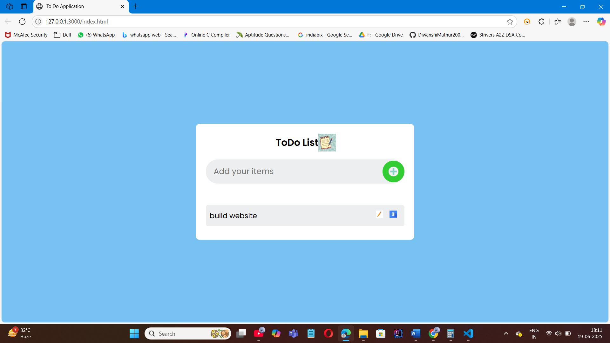
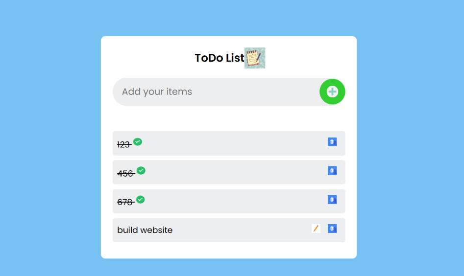

# ✅ To-Do List Web App

A simple and interactive To-Do List built using **HTML**, **CSS**, and **JavaScript**. This project helps users manage daily tasks by allowing them to add, mark, and delete tasks efficiently. It features a responsive design and can optionally store tasks in local storage.

## 🚀 Features
- 📝 Add new tasks
- ✅ Mark tasks as completed
- 🗑️ Delete tasks
- 📱 Responsive layout

## 🛠️ Technologies
- HTML5
- CSS3
- JavaScript (Vanilla)

## 📸 Screenshots

### ➕ Add Task  


### ✅ Complete Task  


### ❌ Delete Task  


## 📂 How to Run

1. Clone the repository:
   ```bash
   git clone https://github.com/your-username/todo-list-web-app.git
   cd todo-list-web-app
